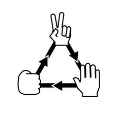

# Rock paper scissors



I made a simple rock paper scissors game by using the randint function choose a random number and makeing that number either rock, paper or scissors.
The idea to correlate the items with the numbers just popped up into my head one day and I wrote it down.

## How to actually play the game

Type in the text below in the terminal to play.

``` python
python RPS_test.py
```
### Other notes

➞ **TURN ON CAPS LOCK** 

- Very important to turn on caps lock or else nothing will work at all

➞ Push either R, P, or S ONLY.

- If you push anything else it won't register 

➞ Push ctrl + x and enter to stop playing.

- For when you want to touch some grass.


music for when you play ➞ https://music.youtube.com/

---
Professionally made by a professional idiot  🧊

---

